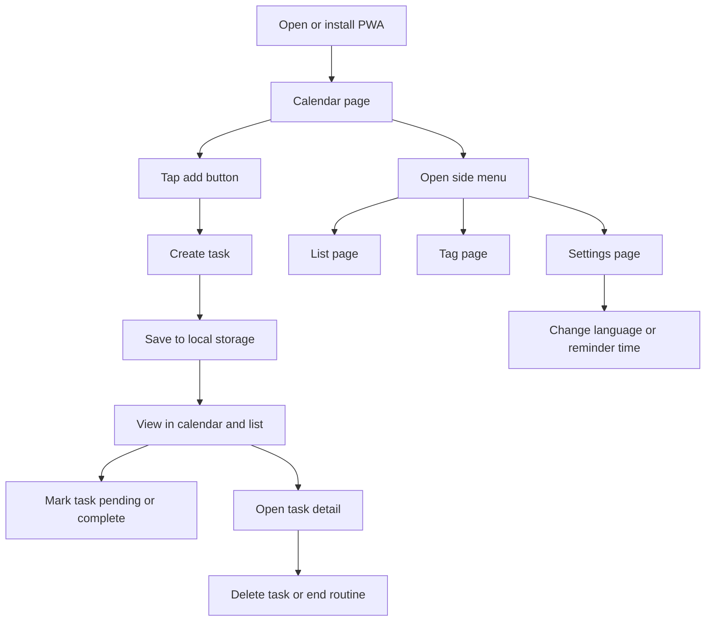

## 1. Product Overview
Task List Mobile App is a mobile-first task manager delivered as an installable Progressive Web App (PWA).
- It helps users track one-off and monthly routine tasks with list, calendar, and tag-based views.
- It focuses on local-first usage, fast mobile interaction, bilingual UI, and browser installability.

## 2. Core Features

### 2.1 User Roles
No role distinction is required in the MVP.

### 2.2 Feature Module
1. **Calendar page**: default landing page, month grid, severity highlights, selected-day task list.
2. **List page**: deadline-sorted task overview with Outstanding and To-Do sections plus incremental loading.
3. **Tag page**: custom tag management and filtered task browsing.
4. **Task editor**: create, edit, delete, and inspect task details from a mobile-friendly sheet or modal.
5. **Settings page**: language, notification preference, and daily reminder time.

### 2.3 Page Details
| Page Name | Module Name | Feature description |
|-----------|-------------|---------------------|
| Calendar | Month calendar | Shows current month by default, colors days based on task count and urgency, highlights today and selected date |
| Calendar | Selected date tasks | Lists tasks for the chosen date at the bottom, supports Complete and Pending actions |
| List | Outstanding section | Shows tasks with deadline earlier than today and status not equal to Complete |
| List | To-Do section | Shows tasks with deadline today or later, sorted by deadline ascending |
| List | Infinite loading | Loads 5 task cards at a time and appends more on scroll |
| Tag | Tag manager | Creates and deletes custom tags with name and color |
| Tag | Tag filter result | Shows tasks that contain the selected tag |
| Task editor | Task form | Captures task name, detail, photo, deadline, routine flag, tags, and Must Do flag |
| Task detail | Task actions | Supports Delete and End Routine Task when applicable |
| Settings | Language | Switches between English and Chinese immediately |
| Settings | Notification | Turns browser notifications on or off and stores reminder time |
| Settings | Reminder feasibility note | Explains browser support limits for closed-app alerts |

## 3. Core Process
Primary flow: the user installs the PWA, lands on the calendar page, creates tasks from the floating action button, reviews tasks in calendar or list view, manages tags for filtering, and configures reminder preferences in settings.

## 4. User Interface Design

### 4.1 Design Style
- Primary colors: deep navy base, warm off-white surfaces, vivid coral and amber accents for urgency and Must Do states
- Button style: rounded mobile controls with strong contrast and thumb-friendly sizing
- Typography: clean sans-serif body with a higher-contrast display face for headings
- Layout style: mobile-first single-column canvas with a collapsible left rail that remains icon-only by default
- Icon style: outlined icons with color-coded status pills and subtle elevation

### 4.2 Page Design Overview
| Page Name | Module Name | UI Elements |
|-----------|-------------|-------------|
| Calendar | Month grid | Color wash intensity per day, selected-day ring, today marker, month navigation |
| Calendar | Bottom task list | Compact task cards, deadline text, tag chips, Must Do alert icon, inline actions |
| List | Task card | Task name, deadline, tag color chip, Must Do icon, Complete and Pending buttons |
| List | Section headers | Distinct Outstanding and To-Do headers with task counts |
| Tag | Tag list | Tag color swatches, add button, delete control, selected-state highlight |
| Task editor | Add or edit form | Sticky save action, image upload preview, routine toggle, date picker, tag multi-select |
| Settings | Preference cards | Language segmented control, notification toggle, reminder time picker, support note |

### 4.3 Responsiveness
- Mobile-first layout is required because this product targets phone usage first.
- The left menu stays collapsed to icons by default and expands on tap.
- All touch targets must meet at least 44x44 px.
- Calendar and lists must remain usable between 320 px and tablet widths.

## 5. Functional Rules
- `Outstanding` contains tasks whose deadline is earlier than today and whose status is not `Complete`.
- `To-Do` contains tasks whose deadline is today or later and whose status is not `Complete`.
- Task cards show task name, deadline, tag color, and `!` when `Must Do` is enabled.
- Calendar is the default page on first load and after installation.
- Each list batch shows 5 tasks, then loads the next 5 when the user scrolls near the bottom.
- `Complete` hides the task from active lists.
- For routine monthly tasks, `Complete` only completes the occurrence for the selected month.
- `Pending` keeps the task visible but marks it with a pending status.
- `Delete` permanently removes a non-routine task or a single occurrence where allowed by implementation design.
- `End Routine Task` stops future monthly generation for the selected routine task series.

## 6. Notification Scope And Feasibility
- The app should use PWA techniques so it can be installed from the browser.
- The MVP should support in-app reminder checks and browser notification permission handling.
- Exact local-time alerts while the web app is fully closed are not guaranteed across browsers because standard PWAs do not provide a universal closed-app scheduler.
- Best-effort support is possible on some browsers with service worker and notification capabilities, but it is platform-dependent and especially limited on iPhone and iPad browsers.
- The settings page must clearly explain this limitation so the feature is honest and understandable.
- If guaranteed hard warnings are a strict business requirement, a native mobile app or a backend-driven push service will be needed later.

## 7. Acceptance Criteria
- User can install the app from a supported mobile browser as a PWA.
- User sees the calendar page first after app launch.
- User can create a task with task name, detail, photo, deadline, routine flag, tags, and Must Do flag.
- User can mark a task as Complete or Pending from the task card.
- User can delete a task from task detail.
- User can end a routine task series from task detail.
- User can create and delete tags and filter tasks by selected tag.
- User can switch the UI language between English and Chinese.
- User can set a daily reminder time and read the browser support note for notifications.

## 8. Non-Functional Requirements
- Launches quickly on mobile and remains usable offline for previously loaded assets and locally stored data.
- Stores user data locally on device for MVP without requiring account creation.
- Preserves smooth scrolling and interaction while rendering large task lists incrementally.
- Keeps the interface accessible with strong contrast, semantic labels, and keyboard-safe fallbacks.
