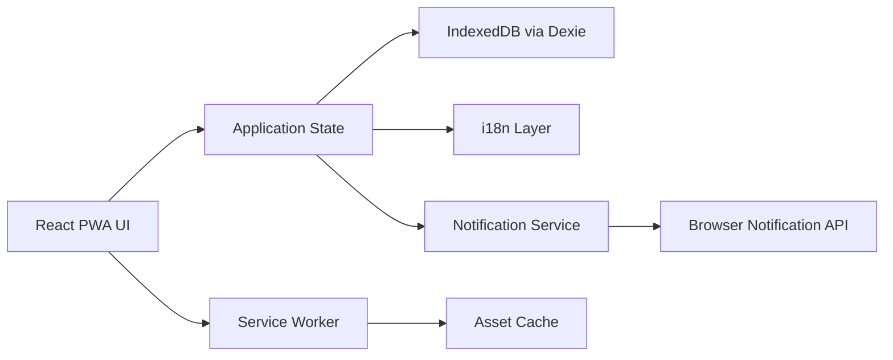

## 1. Architecture Design



The app is a frontend-only PWA for the MVP. It uses local-first storage, offline asset caching, and browser APIs for installability and best-effort notifications.

## 2. Technology Description
- Frontend: React 18 + TypeScript + Vite
- Styling: Tailwind CSS 3
- PWA: `vite-plugin-pwa` with generated service worker
- Storage: IndexedDB via Dexie
- State: React Context plus focused hooks
- Routing: React Router
- Internationalization: react-i18next
- Date logic: date-fns
- Icons: Lucide React
- Testing: Vitest + Testing Library

## 3. Route Definitions
| Route | Purpose |
|-------|---------|
| `/` | Calendar page as default entry |
| `/list` | Outstanding and To-Do list view with incremental loading |
| `/tags` | Tag management and tag-filtered tasks |
| `/settings` | Language, notification, and reminder settings |

## 4. Frontend Module Design
| Module | Responsibility |
|--------|----------------|
| `app/layout` | Shell, collapsible left rail, floating action button, page framing |
| `features/calendar` | Month grid, severity coloring, selected-date task list |
| `features/list` | Deadline sorting, Outstanding and To-Do grouping, 5-item incremental loading |
| `features/tasks` | Task form, detail sheet, status transitions, photo upload preview |
| `features/tags` | Tag CRUD, color selection, tag filter |
| `features/settings` | Language switch, notification preference, reminder time, support note |
| `services/storage` | IndexedDB schema and persistence |
| `services/notifications` | Permission request, reminder checks, browser notification dispatch |
| `services/pwa` | Manifest metadata, install prompt handling, service worker lifecycle |

## 5. Data Model

### 5.1 Type Definitions
```ts
type TaskStatus = "todo" | "pending" | "complete";

interface Tag {
  id: string;
  name: string;
  color: string;
  createdAt: number;
}

interface TaskSeries {
  id: string;
  name: string;
  detail: string;
  photo?: string;
  deadlineDay: number;
  deadlineMonth?: string;
  isRoutine: boolean;
  endedAt?: string;
  isMustDo: boolean;
  tagIds: string[];
  createdAt: number;
}

interface TaskOccurrence {
  id: string;
  seriesId: string;
  date: string;
  status: TaskStatus;
  completedAt?: string;
  deletedAt?: string;
}

interface Settings {
  language: "en" | "zh";
  notificationsEnabled: boolean;
  dailyReminderTime: string;
  reminderSupportAcknowledged: boolean;
}
```

### 5.2 Modeling Strategy
- One-off tasks are stored as a `TaskSeries` with `isRoutine = false` plus one occurrence.
- Monthly routine tasks are stored as a `TaskSeries` with `isRoutine = true`.
- Calendar and list views derive month-specific entries from `TaskSeries` plus any matching `TaskOccurrence` records.
- Completing a routine task only marks the selected monthly occurrence as `complete`.
- Ending a routine task writes `endedAt`, which prevents future occurrences from being generated.
- Deleting a one-off task removes the series and its single occurrence.

## 6. Storage Design

### 6.1 IndexedDB Stores
| Store | Key | Purpose |
|-------|-----|---------|
| `taskSeries` | `id` | Base task definition and recurrence settings |
| `taskOccurrences` | `id` | Per-date completion, pending, and delete state |
| `tags` | `id` | User-defined tag names and colors |
| `settings` | `id` | App preferences |

### 6.2 Persistence Rules
- Use IndexedDB as the primary data store because it handles structured local data better than `localStorage`.
- Persist uploaded photos as compressed data URLs with size validation.
- Keep the schema versioned to allow future migration.
- No backend is required for the MVP.

## 7. PWA Design

### 7.1 Manifest
- Provide app name, short name, theme color, background color, icons, and `display: standalone`.
- Use portrait orientation by default.
- Enable browser installation from supported mobile browsers.

### 7.2 Service Worker
- Cache static assets for offline shell loading.
- Cache fonts, icons, and built bundles with revisioning.
- Do not claim support for guaranteed scheduled background execution.

### 7.3 Install Experience
- Detect `beforeinstallprompt` where supported.
- Show an install hint inside the app for unsupported browsers with manual instructions.

## 8. Notification Architecture
- Request notification permission only when the user enables reminders in settings.
- Store the desired reminder time in local settings.
- Run reminder evaluation when the app is opened, resumed, or already active near the configured time.
- Optionally send browser notifications while the web app is active or when the service worker can react to a supported event.
- Clearly label closed-app reminders as best-effort only.
- Treat true exact-time closed-app alarms as out of scope for the frontend-only MVP.

## 9. UI Behavior Rules
- Left menu defaults to collapsed icon-only mode and expands on tap.
- Calendar is the default route and primary navigation anchor.
- List view sorts tasks by deadline ascending, then splits them into Outstanding and To-Do groups.
- Each list render starts with 5 items and appends more on scroll.
- Task cards display task name, formatted deadline, tag chips, and a Must Do indicator.
- `Complete` and `Pending` are inline card actions.
- `Delete` and `End Routine Task` are available from the task detail sheet.

## 10. Internationalization
- Use `react-i18next` with `en` and `zh` translation namespaces.
- Localize labels, button copy, empty states, settings text, and notification messaging.
- Use locale-aware date formatting while keeping input parsing compatible with `dd/mm/yyyy`.

## 11. Accessibility And Performance
- Keep touch targets at or above 44x44 px.
- Use semantic buttons, labels, and ARIA text for icon-only controls.
- Lazy-render list batches and memoize expensive calendar calculations.
- Compress uploaded photos before persistence to reduce storage usage.

## 12. Risks And Decisions
- Browser notification support varies significantly by platform.
- iOS browser support is the weakest path for closed-app reminder behavior.
- If guaranteed hard warning is mandatory, a native mobile app or server push architecture should replace the MVP notification design.
- The frontend-only PWA remains the fastest path for the requested installable mobile web version.
